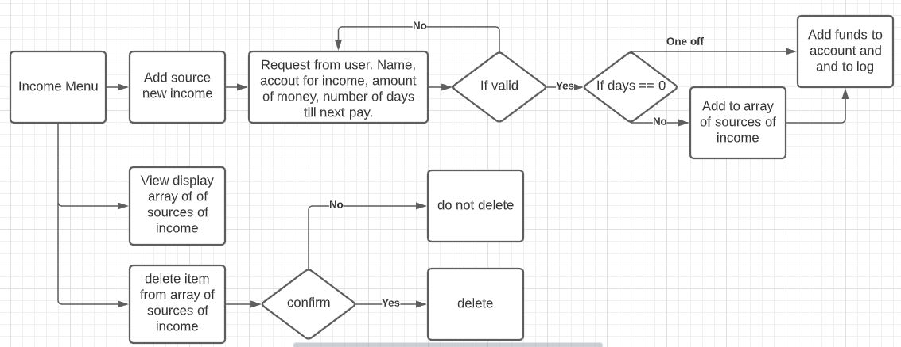

# T1A3

# Software Development Plan
Develop a statement of purpose and scope for your application. It must include:
<!-- - describe at a high level what the application will do -->
The budge APP's Purpose is to help the user keep track of their money and expenses. The App will help the user manage their account, manage their income, log their expenses, and estimate the time it will take to reach a financial goal based of that information.

<!-- - identify the problem it will solve and explain why you are developing it -->
This app will serve to assist people in saving their money by clearly showing the user their income and expenses. It will help the user set long and short term savings goals and calculate how long it will take to reach those goals.
  I am developing this app because i am currently saving up for a bank lone and wanted an easy way to visualize my expenses and paint a realistic image of how long it will take to reach my goal.
<!-- - identify the target audience -->
The targe audience is anyone who wishes to save money or simply help manage their money.
<!-- - explain how a member of the target audience will use it -->
The audience will use the app through a simple terminal interface, all math will be done by the program so users don't have to worry about it.

<!-- Develop a list of features that will be included in the application. It must include: -->
<!-- Note: Ensure that your features above allow you to demonstrate your understanding of the following language elements and concepts:
- use of variables and the concept of variable scope
- loops and conditional control structures
- error handling -->
## Accounts - keep track of total money  
The budget app will allow the user to create multiple accounts which will serve to mirror the users bank account.  
This information will be sorted in an account variable (integer), which in tern will be sorted in an array of accounts. This will all be stored in a text file.
## Income - log incoming money  
Once accounts have been made an income will be set up. This amount will be added to the selected account at regular intervals determined by the user. This can also be done manually if the user's pay changes frequently. The user will be able to set up different sources of income if there is more than one. 
the incoming money will be added to the corresponding account (converted to an integer ), each different source of income from that period will be logged in an income array and stored for later use.
## Expenses - log out going money  
The next feature is a diary of the users expenses since the last payment, this will then show the user how much money they have left. There will also be different catagories like, taxes, showing, and other for the expenses to be divided into. 
Expences will be deducted from an account and logged in text file. 
## Transfer money. 
This feature will combine the methods from the expenses and income features by removing money from one account and adding the same amount to another. This feature will not work if the specified amount of money to transfer if greater than the amount in the account.
## Goal - estimate time to reach goal  
Finally the app will user the amount in the account, and the rate that the user saves money to calculate how long it will take from the user to reach a savings goal (the amount will be set by the user). A loop will take the average income of each pay cycle and calculate roughly how long it will take to save up to the users goal. If the value is negative it will inform you that you are losing money.

<!-- Develop an outline of the user interaction and experience for the application.
Your outline must include:
- how the user will find out how to interact with / use each feature
- how the user will interact with / use each feature
- how errors will be handled by the application and displayed to the user -->
The user will be present with a money indicating the 5 menus they can use as will as a brief text description on how to use the app. Each feature will have further instructions and promoting on in regards to what the user needs to impute and how to navigate the menu.

NAVIGATING GEM __________________________________________________________________
- how the user will interact with / use each feature__________________________________________________________________
<!-- - how errors will be handled by the application and displayed to the user -->
Tests will be writer to determine the expected output of each method in order to reduce errors in code. Errors caused by the user providing invalid data will display a message to the user explaing what they did wrong and what they need to do, and prompt them to try again.
<!-- 
Develop a diagram which describes the control flow of your application. Your diagram must:
- show the workflow/logic and/or integration of the features in your application for each feature.
- utilise a recognised format or set of conventions for a control flow diagram, such as UML. -->

Account
 - create
 - view 
 - delete 

Income
 - create new income
    1. name of source
    2. account payed to
    3. amount 
    4. how many days between payments? (0== one of payment/)
 - view existing income sources
    view list of sources of income
 - delete existing income sources
    remove from list of income
   
   
   
   

# Implementation plan
<!-- - outlines how each feature will be implemented and a checklist of tasks for each feature
- prioritise the implementation of different features, or checklist items within a feature
- provide a deadline, duration or other time indicator for each feature or checklist/checklist-item

Utilise a suitable project management platform to track this implementation plan

> Your checklists for each feature should have at least 5 items. -->
Order of importance is for feature implementation is Account, Income, Expences, Goal, and then Transfer.
Account is the simplest to implement because it is just creating and storing a number but it is the most important because everything else depends on it working. Transfer is the least important because it isn't needed for the app to work but would be nice to have.

Account - 1 hour
   - create account (with value and add to account list)
   - delete account (remove from account list)

Income - 2 hours
- add source of income (amount, name)
- view list
- remove source from list 
- button to add source of income to accounts

Expenses - 2 hours
- add expenses (amount, name)
- view list
- remove expenses list 
- button to deduct listed expenses from accounts

Goal - 2 hours
take amount in account add income and duct expences until a goal is reached, return the number of times this was done to determine how long it will take to reach the goal

Transfer -  1 hour
take founds from one account and add the same amount to another 

# help documentation
